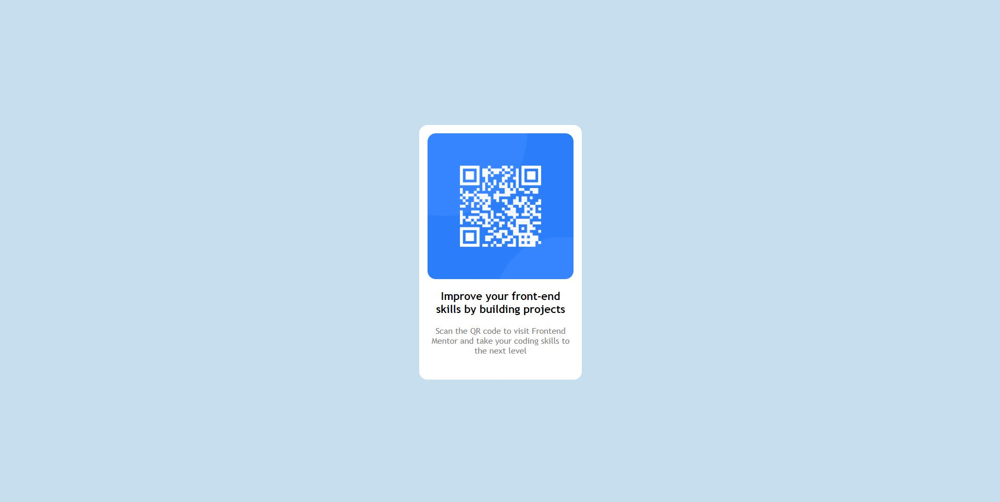

## Table of contents

- [Overview](#overview)
  - [Screenshot](#screenshot)
  - [Links](#links)
- [My process](#my-process)
  - [Built with](#built-with)
  - [What I learned](#what-i-learned)
  - [Continued development](#continued-development)
  - [Useful resources](#useful-resources)
- [Author](#author)
- [Acknowledgments](#acknowledgments)

## Overview

### Screenshot

### Links

- Solution URL: [GitHub](https://github.com/P4ZD4N/qr-code-component)
- Live Site URL: [Vercel](https://wiktorcqrcode.vercel.app/)

## My process

### Built with

- Semantic HTML5 markup
- Sass/SCSS
- BEM
- Flexbox

### What I learned

Doing this challange I:

- Developed my skills in BEM methodology,
- Developed my skills in SCSS,

## Author

- GitHub - [@P4ZD4N](https://github.com/P4ZD4N)
- Frontend Mentor - [@P4ZD4N](https://www.frontendmentor.io/profile/P4ZD4N)
- LinkedIn - [@Wiktor Chudy](https://www.linkedin.com/in/wiktor-chudy/)
